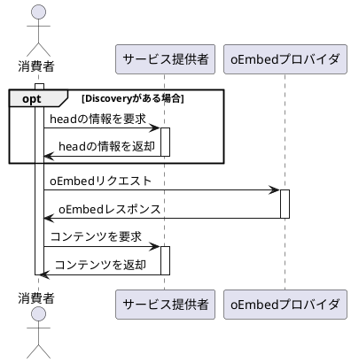

HexoにYouTubeなどのサイトを記事に埋め込むためのプラグインを作成しました。
本当はYouTubeが埋込たかったわけではなくて、のスライドが埋込みたかっただけなんですが、を利用して汎用的な作りにしたので結果的にそうなってしまいました。ついでにもったいないからnpm[^1]に公開しました。この記事はそのプラグイン制作記事の前編です。




[^1]: はNode.jsのパッケージ管理システムです。Node Package Managerが由来ですがnpmのページの左上を見るとクリックするごとに色々は`NPM`に出会えます(笑)。現在ではJavaScriptのパッケージ管理システムのデファクトスタンダートとなっています。

<!-- more -->

## 目次
<!-- toc -->

## 前提

この記事はHexoのhexo-oembedプラグインの制作記事です。Hexoプラグインを作って見たい方、oEmbedの仕様に興味のある方、OSSへの貢献方法を一連の流れで知りたい方向けの記事となっています。
hexo-oembedの使い方そのものが知りたい方は以下のページを御覧ください。

- 

早速製作記事に入りたいと思いますが、このブログで使われている静的サイトジェネレータのHexoのことを知らない方も多いと思います。この記事はHexoのプラグインの話なので知らない方は過去に書いた以下の記事を一読されることをオススメします。



Hexoは記事をMarkdownで記述することができるのですが、マークダウンで記述できないリッチなコンテンツ(例えばYouTubeの動画)を表示させたい場合は、以下のような形式で独自のタグを作成して表示させることができます。



作成したタグは自分で利用できるのはもちろんですが、Hexoはプラグイン機能を持っているので、プラグイン化してタグを再利用しやすくすることもできます。

## なぜHexoのタグを新しく作ろうと思ったか

冒頭でも書きましたが、のスライドを貼りたくなったからです。
具体的には以下の前回の記事で貼りたくなりました。



Speaker Deckのような埋込みを意識してあるサイトでは概ね埋め込み用のHTMLを取得できるようになっていて、MarkdownにそのままそのHTMLを貼れば表示させることもできるのですが、やはり記事の書きやすさを考えるとスライドのパーマリンクから自動的に埋め込み用HTMLを展開してくれた方が望ましいわけです。

しかし、希望のタグは公式のには存在せず、の中にも該当するものが見当たらなかったので、自作することにしました。

## Hexoのタグの作り方

にある通りタグ名を決めて展開したいHTMLタグを文字列で返すだけです。引数もargsに配列で渡ってくるのでオプション付きのタグを作るのも簡単です。ちなみに空白付きの引数を渡したいときはダブルクォートで囲ってあげれば大丈夫です。


hexo.extend.tag.register('youtube', function(args){
  var id = args[0];
  return '<div class="video-container"><iframe width="560" height="315" src="http://www.youtube.com/embed/' + id + '" frameborder="0" allowfullscreen></iframe></div>';
});


ディスクからファイルを読み出したり、インターネットから取ってきた情報をもとにタグを作りたい場合には、非同期処理を利用することがよくあります。その場合は以下のようにオプションで`async: true`を渡してあげてプロミス[^2]を返すようにしてあげれば問題ありません。実は最初は一番目の文字列を返す方式で実装するつもりだったのですが、いろいろと問題があって結局このプロミス方式で実装することになります。


var fs = require('hexo-fs');
var pathFn = require('path');

hexo.extend.tag.register('include_code', function(args){
  var filename = args[0];
  var path = pathFn.join(hexo.source_dir, filename);

  return fs.readFile(path).then(function(content){
    return '&lt;pre&lt;code&gt;' + content + '&lt;/code&gt;&lt;/pre&gt;';
  });
}, {async: true});


[^2]: 一般的に「プロミス」といえば非同期処理を扱うための手法または概念の一つですが、ここで言うプロミスとはJavaScriptの標準仕様であるで定義されているプロミスを指しています。JavaScriptの仕様に比較的最近入った仕様ですが最近のモダンブラウザでは問題なく利用することができます。またHexoが基盤として利用しているでも標準仕様のプロミスがサポートされています。標準のプロミスについてはによくまとめられているので参考にしてみてください。ちなみにJavaScriptのライブラリとして実装されている「プロミス」は標準仕様に準拠したもの以外にも星の数程あるのでそれらと混同しないようにしてください。有名なものではがあり、これはHexo内部でも利用されています。

## Speaker Deckのタグを作ろうとして惨敗

さて、Hexoのタグの作り方が分かったところで本命のSpeaker Deckのタグを作ってみることにしました。目標はスライドのパーマリンクから埋め込み用のHTMLを生成することです。そして適当なスライドのパーマリンクと埋め込み用のHTMLを比較してみて愕然としました・・・


https://speakerdeck.com/lynnandtonic/art-the-web-and-tiny-ux



<script async class="speakerdeck-embed" data-id="a6f09ce505e740f98bc816afa763e872" data-ratio="1.77777777777778" src="//speakerdeck.com/assets/embed.js"></script>


お分かり頂けたでしょうか？
最初の想定ではパーマリンクが分かれば文字列処理で埋め込み用HTMLを生成できるはずでした。しかし、蓋を開けてみると`data-id`なるどこぞの馬の骨ともわからないものがなければ生成できないではありませんか！

__F●●K----------__

おっと、失礼。ついつい心の叫びがキーボードに伝わってしまいました。僕は悪くないよ。こうして、当初の目論見が破れて涙に暮れること3000年、突如救世主が現れました・・・

## oEmbedとは

閑話休題。
真面目な話、正直どうしようかと色々調べていたらSpeaker Deckがに対応していることを知りました。oEmbedは簡単に言えば、パーマリンクを埋め込み用HTMLに変換するためのWeb API仕様です。仕様はオープンになっておりYouTubeやTwitterやFacebookなども採用していて、コンテンツを埋め込むための業界標準となっています。そしてパーマリンクから埋め込み用HTMLを生成するサービスの提供側をoEmbedの`プロバイダ`というのですが、Speaker DeckはoEmbedのプロバイダであり、サービス提供の受付口である`エンドポイント`と受付可能なパーマリンクのフォーマットを定義する`スキーマ`を公開していました。ここからは公式のサンプルを引用しながら具体的に説明します。

- サービス提供者
  - flicker
    - パーマリンク
      - `http://www.flickr.com/photos/bees/2341623661/`
- oEmbedプロバイダ
  - flickr
    - URLスキーマ
      - `http://www.flickr.com/photos/*`
    - APIエンドポイント
      - `http://www.flickr.com/services/oembed`
- 消費者
  - oEmbedリクエスト(HTTP GETリクエスト)
    - `http://www.flickr.com/services/oembed/?format=json&url=http%3A//www.flickr.com/photos/bees/2341623661/`
  - oEmbedレスポンス(JSON形式)

```json
{
  "version": "1.0",
　 "type": "photo",
　 "width": 240,
　 "height": 160,
　 "title": "ZB8T0193",
　 "url": "http://farm4.static.flickr.com/3123/2341623661_7c99f48bbf_m.jpg",
　 "author_name": "Bees",
　 "author_url": "http://www.flickr.com/photos/bees/",
　 "provider_name": "Flickr",
　 "provider_url": "http://www.flickr.com/"
}
```

まずはサービス提供者とoEmbedプロバイダと消費者という、３つの登場人物がいることに注目しましょう。サービス提供者は文字通り埋め込み用コンテンツを提供する側です。この例では写真共有サービスのflickrになっており、埋め込みコンテンツを指定するためのパーマリンクを公開しているものとします[^3]。

oEmbedプロバイダは前に説明したとおり、パーマリンクを埋め込み用HTMLに変換するための情報を提供します。ここでURLスキーマと見てみると、photosの後にアスタリスク(`*`)が指定されていることがわかります。これは任意の文字列を表していて、`photos/`以降の文字列がどんな場合でもパーマリンクはマッチすることになります。

最後に消費者にです。消費者は埋め込み用HTMLが欲しい人です。そのためにはパーマリンクおよび、パーマリンクを受け付けるoEmbedプロバイダの両方を知っている必要があります。消費者はoEmbedプロバイダに埋め込み用コンテンツを要求しますが、リクエストの構造は単純でHTTPのGETリクエストでエンドポイントを指定し、クエリとして最低限パーマリンクを指定するための`url`とレスポンス形式を指定するための`format`を指定するだけです。ここではformatは`json`を指定していますが、`xml`を指定することもできます。oEmbedプロバイダはどちらか片方のフォーマットだけサポートしてもよいし、両方サポートしても良いことになっています。

レスポンスは見たままなのであまり説明することはありませんが、`type`だけ付け加えると`photo`の他に`link`と`video`と`rich`があります。`photo`は写真の埋め込みに使います。画像のURLを`url`パラメータで返してくれるのでそのURLを`img`タグで表示してあげればよいだけです。`title`パラメータがあれば`alt`属性に設定しましょう。 `video`と`rich`の２つのタイプはについて説明するとこれらは`html`パラメータを持っていていてこの中身を直接埋め込めばいいので一番ラクです。`html`の中身は経験上`iframe`タグになっていることが多いです。`link`は面白くないしあまり使われているところをみたことがないので割愛します。

[^3]: 一般的にはパーマリンクが用いられることが多いですが、oEmbedの仕様上は特にパーマリンクでなければならないという制約はありません。ちなみに例のパーマリンクのURLは公式のサンプルに乗っていたものであり、実際の写真の中身には自分は関知しておりません。あのパーマリンクを開くことによるいかなる被害および損害の責任はとれませんのでご了承ください・・・誰？

### hexo-tag-oembed現る

さて、ここまで調べて実はoEmbedに対応したタグならあるんじゃないかと思ってGoogle先生に相談したら、案の定みつかりました。



しかし残念ながら、このタグはお目当てのSpeaker Deckには対応していませんでした。しかもエンドポイントをソースコードに埋め込んでいたのでSpeaker Deckに対応してもらうためにはプルリクエストを送らないといけません。最初は素直にプルリクエストを送ろうかと考えていたのですが、oEmbedに対応しているサイトは大量にあるのでそのたびにプルリクエストを送るのもなんだかなぁーというお気持ちになりました。そもそもいちいちプロバイダー探してエンドポイントの定義なんて面倒くさいし何とかならないのかと、もう一度公式のドキュメントを眺めてみると、うん、ちゃんとおあつらえ向きな仕様があるではありませんか！　`Discovery`です。

### 真打ちoEmbed Discovery

Discoveryは、簡単に言うと前述のoEmbedリクエストをHTMLのヘッダに埋め込める仕様です。これも公式のサンプルを見てもらった方が早いでしょう。


<link rel="alternate" type="application/json+oembed"
  href="http://flickr.com/services/oembed?url=http%3A%2F%2Fflickr.com%2Fphotos%2Fbees%2F2362225867%2F&format=json"
  title="Bacon Lollys oEmbed Profile" />


素晴らしい。先程の悩みは一瞬で解決しました。パーマリンク先がDiscoveryに対応していれば、まずHEADリクエストでヘッダだけ引っ張ってきて、linkタグのtypeが`application/json+oembed`または`application/json+xml`なものを探して、`href`属性が示すURLにリクエストするだけでお目当てのoEmbedレスポンスが手に入ります。リクエストは一回増えますが致し方ないですね。しかし、ここまでするならいっその事ヘッダにoEmbedレスポンスを埋め込んでくれよ・・・とか思ってしまいますが、ここはグッと我慢します。頭でっかちな奴(HTML)は嫌われますからね。

### 図解oEmbed
ここまでのまとめとしてoEmbedのシーケンス図を描いてみます[^4]。ポイントはサービス提供者とoEmbedプロバイダは分かれてても良いということです。一般的には同じ場合が多いですが、複数のエンドポイントをまとめてくれるoEmbedプロバイダも存在します。とかが有名です。あとDiscoveryはoEmbedの仕様としてはオプションです。しかも対応しなければいけないのはサービス提供者側の各ページなので、oEmbedに対応しているページでもDiscoveryには未対応な場合は結構あります[^5]。



[^4]: このシーケンス図の作成にはを用いています。Hexoのタグとしてはを利用しました。
[^5]: 2019年2月現在、flickr、Gyazo、InstagramはoEmbedには対応しているけどDiscoveryには対応していなさそうでした。ちなみにoEmbedそのものに対応していないサイトとしては自分が試した限りニコニコ動画やAmazonやメルカリがありました。ショッピング系は物量も多いし入れ替わりも早いので仕方がないとしても、ニコ動には頑張ってほしかった・・・

### 後編へと続く・・・

ここにきてようやくHexoのタグを作成する準備が整いました。長かった・・・
後編ではいよいよコーディングの話と公開に至るまでを紹介します。

